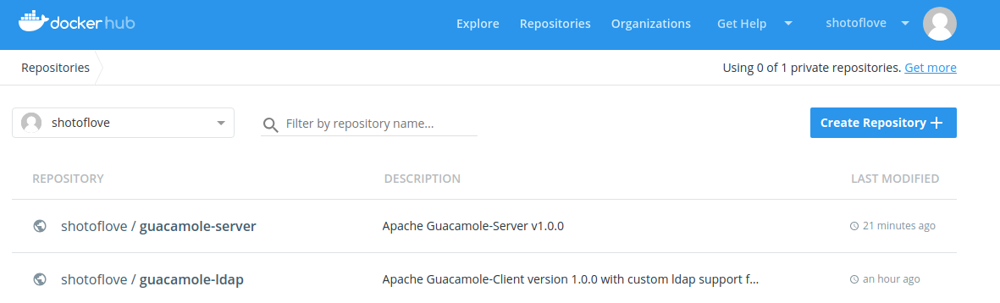
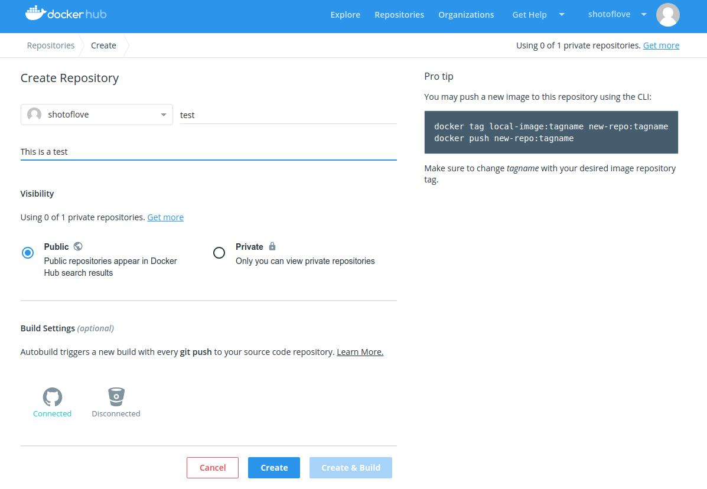
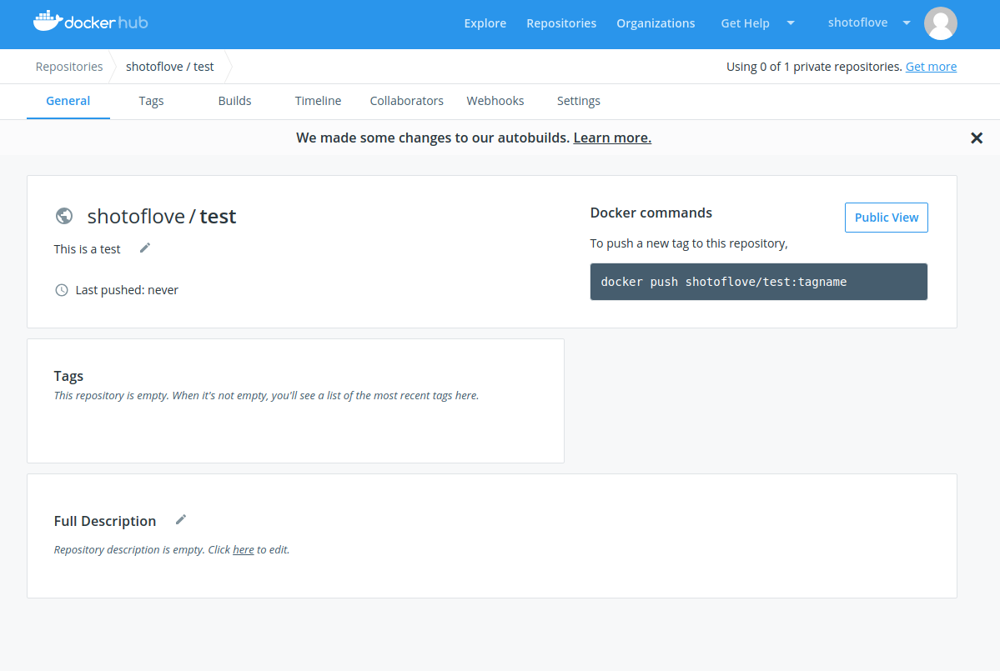
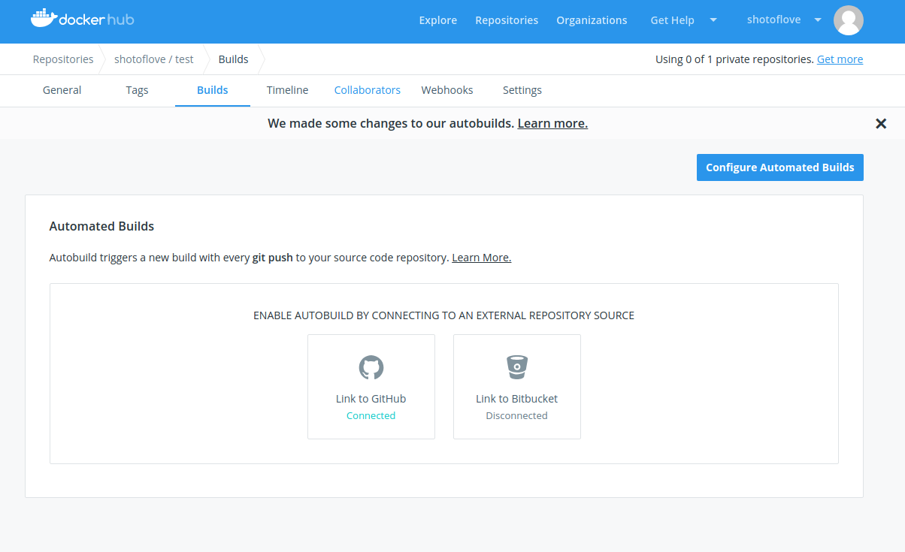
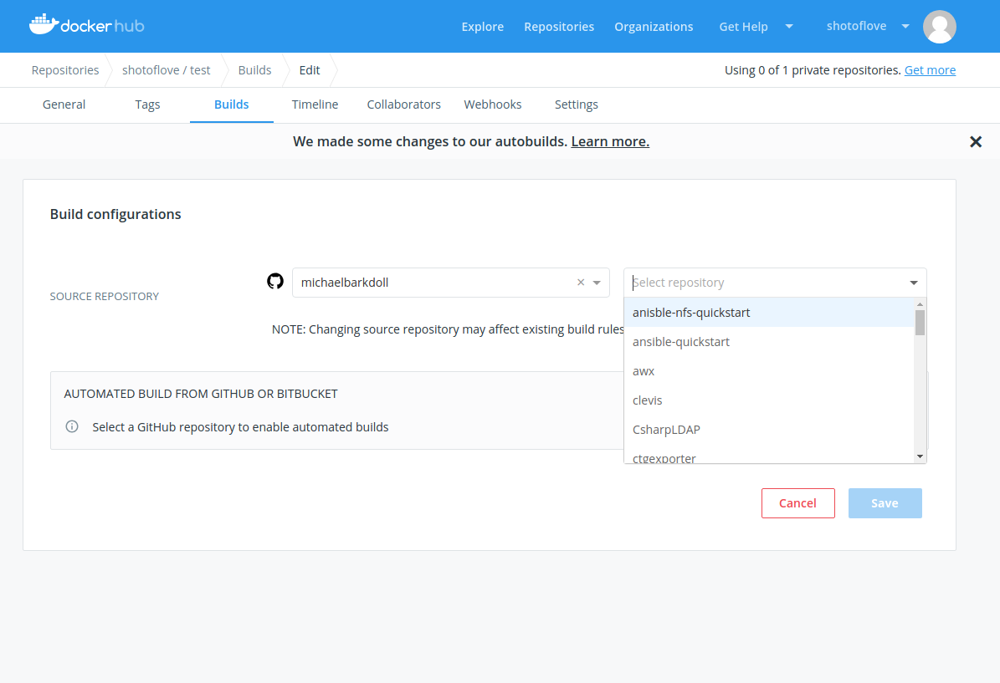
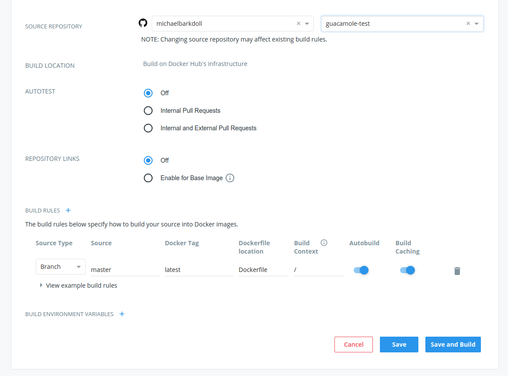

# From local cli deploy to dockerhub

The following allows you to push a locally built Dockerfile that produced an image to DockerHub.

You may push a new image to this repository using the CLI:
```
docker tag local-image:tagname new-repo:tagname
docker push new-repo:tagname
```

Make sure to change tagname with your desired image repository tag.

E.g., To push a new tag to this repository,
```
docker push shotoflove/guacamoletest:tagname
```

# Deploy from github


Create a new repository in DockerHub







Click Builds



Click Configure Automated Builds

Note:  You may need to first configure your GitHub Account with DockerHub.




Select your linked github account and select a repository.



By default the master branch with a Dockerfile at / will be used to build you base image.

Click Save and Build

In this example, well build DockerHub registry, shotoflove/test


